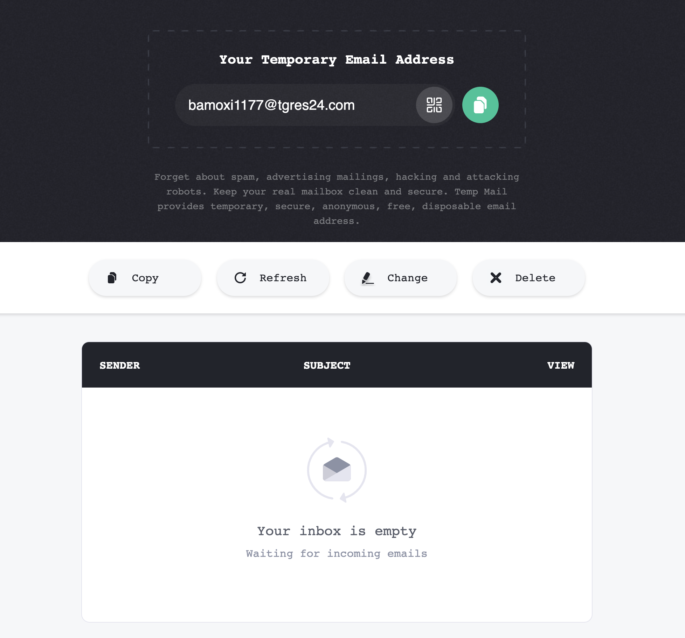
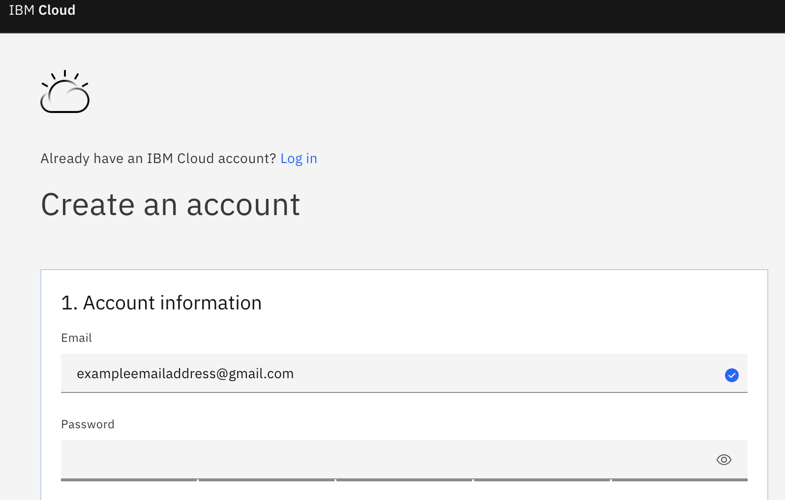
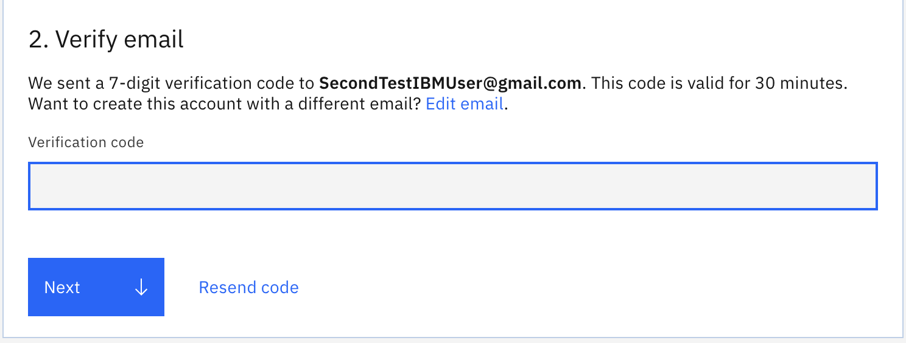
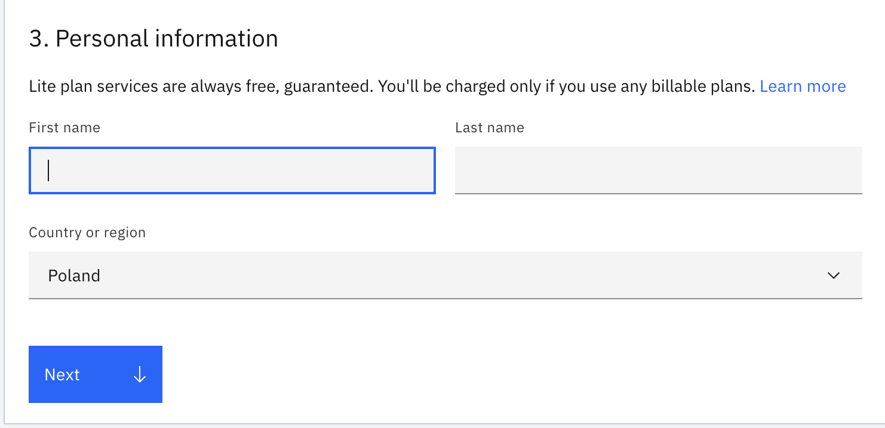
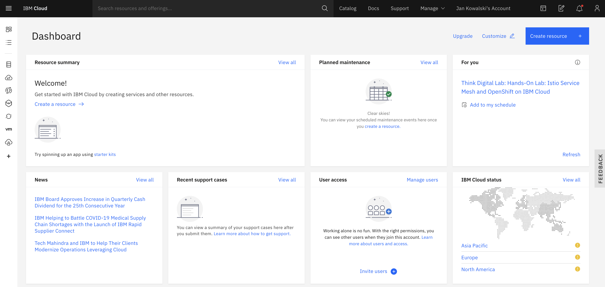
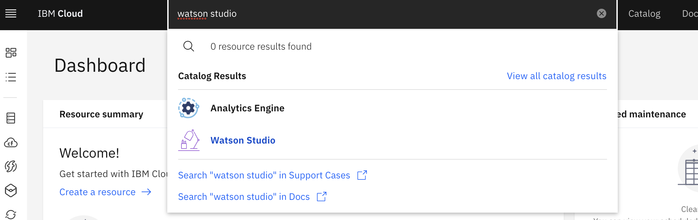
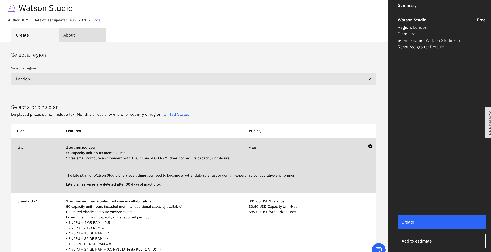
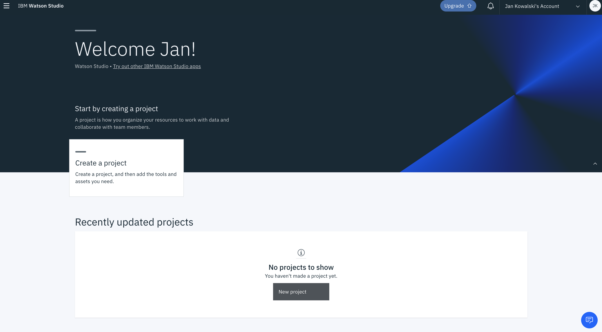

# Preparation Lab    
    
  
    
Returning to the agenda page?  [CLICK HERE](../README.md)  
  
Or maybe returning to the main page? [CLICK HERE](../../README.md)  
    
  
       

  
  
  
  
 
First step is preparing your environment on IBM Cloud. Check the following instructions.  
  
 
  
# Task 1. IBM Cloud registration  
  
All labs are executed on the **IBM Cloud**, and prerequisites are:  
  
- [ ] **1 valid email**   
  
- [ ] account on **IBM Cloud**   
  

**If you already have an IBM id, go to Task 2 of this script.**  
  
If you don't have an email address to use in lab get a temporary email service like this one: https://temp-mail.org/en/  
  
  
  

### Start registration  

Open this link: [IBM Cloud](cloud.ibm.com/registration) or type: http://cloud.ibm.com/registration in the browser (Chrome or Firefox are recommended). You will get to the following page.  
  
  
  
### Fill in the form  
Specify email and password.  
  
> IMPORTANT : Take a note of your email address and your password.  
  
  
  
Click 'Next' button to move to the next page. Now the verification code is generated and sent to your inbox. 
  
  
  
Check your email inbox and get the verification code from the email to the field shown above. Click 'Next' button.  
  
  
  
  
Enter your name, second name and country. Click 'Next' button.  
 
> Your **Lite Account** has **no time restriction**. This is not a 30 day trial account. You are about to build things that will last for ages ;)    
  
Click on **Create Account** button.  
  
  
  
  
Then if everything is fine, you will get on data agreement page. After reading the agreemnent click 'Proceed' button on the bottom of the page.  
  
  
  
Finally you should get a dashboard screen on your cloud account as shown above. First thing you can do is clicking Catalog button and scanning through all services you can use to build your future apps :)   

> IMPORTANT : Have you written down your email and password? Last chance to do it.  
  

# Task 2. Create Watson Studio Instance  
  
Write **"Watson Studio"** in the search pane on the dashboard screen of your IBM Cloud account. Click on the search pane or just wait. You should see scroll down with a Watson Studio service (the one with a lamp icon).  
  
  
  

Click on the Watson Studio Service. You should get to the screen with payment plans (below). This service is for starting one or many instances of Watson Studio.   

  
> Note that your instance will be created in one of IBM Cloud regions. You can choose a region (which means data center for your app or data) that is close to you and is located within the boundaries of Europen Union. In that case no data will leave EU.     
    

Ensure that the Lite Plan is chosen and click Create button on the right bottom corner of the screen.     
    
  
  
    
Welcome to Watson Studio :)  

  
    
    
Take a moment to look at Documentation with great tutorials and scan through Community part where notebooks with various useful models.
  
  
    
    
Now you can click 'Get Started' button.   
There maybe additional message saying that Watson Studio is ready, confirm by clicking 'Get Started' on button in the message box. 
You will see a welcoming screen with of Watson Studio application.  
Congrats :)  
    
  
# End of Preparation Lab