# Lab: Creating Visual Recognition App on IBM Cloud
  

Returning to the agenda page?  [CLICK HERE](../README.md)  

Or maybe returning to the main page? [CLICK HERE](../../README.md)  

  
    
> IMPORTANT: Take your time and do not rush through the scripts. Rather, try to understand new concepts and let them sink in.

# Task 1. Create space in your organization on IBM Cloud account.

Prerequisites for this lab are:

- [ ] Existing **IBM Cloud** account 

- [ ] Started instance of **Watson Studio** on your **IBM Cloud** account 

IBM Cloud has several demonstration apps that you just need to find and start. Visual Recognition app is one them. It will demonstrate you how Watson services are used.

When logged in to IBM Cloud account navigate to Manage - Account menu in the top right corner of the screen.  

  
 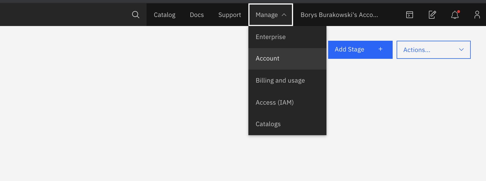      
  
  
Now click on Cloud Foundry orgs square in mid-screen.       
  
  
 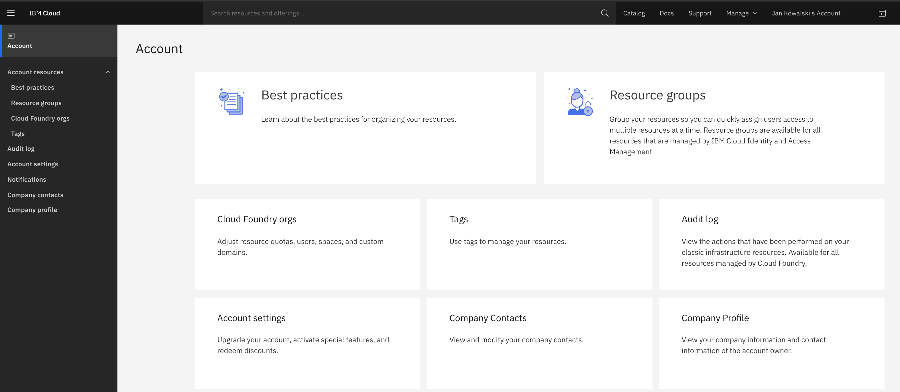    
  
Next click on your email address (visible on picture below) to enter your organization (at this moment this is the only org on your IBM Cloud account).  

> Organizations and spaces are a way to organise applications based on cloud foundry. Oragnization can represent a department or a company. Within the organisation you can create many spaces. Space can represent apps, projects.

    
 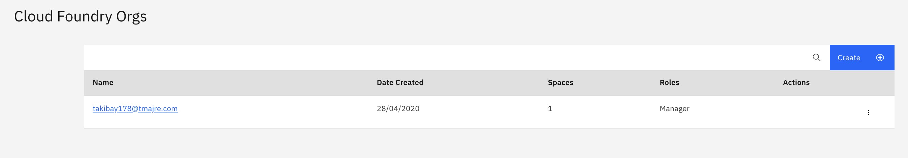         
    
In your organization there is only one space: 'dev'. Create another space using 'Add Space' button on the upper right.  
    
 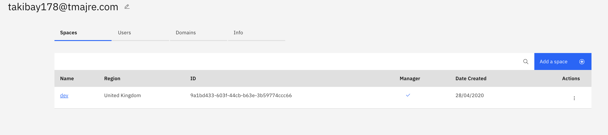      
    
Select the region available and put a name for your space (for example: my-watson-app). Click the 'Save' button.     
> Note: write down the name of the region. You will need it while starting your app.  
    
 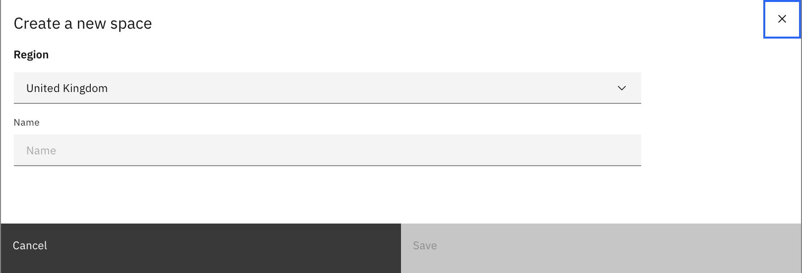          
      
You should see a new space in a list, like on the screen below:    
      
 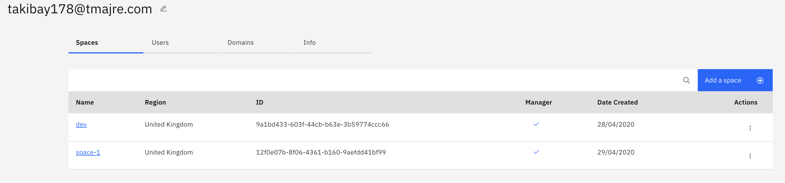        
    
  
# Task 2. Creating Visual Recognition App on IBM Cloud    
  
Now when a space is created you will have a place to put your app in.         
Navigate to your dashboard on IBM Cloud. You can use first icon on the vertical menu on the left.      
    
         
    
  

Right now Click on the search pane and write **"demo"**. You should see a 'Visual Recognition Node.js App' (among other things).    
      
 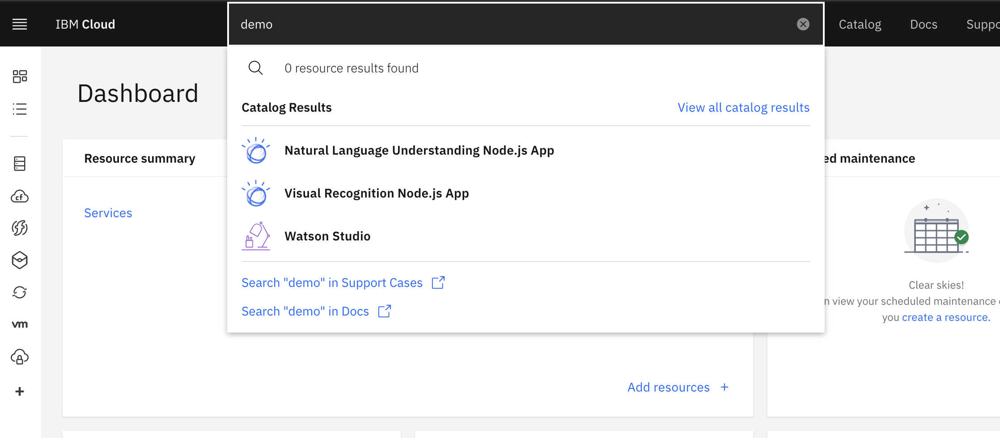      
    
Click on that app. You will get to a page descibing what is exaclty started.    
      
> Note that first instance Visual Recognition service is free, so you don't have to worry about any charges. This rule applies to majority of services available on IBM Cloud. First service comes for free on a Lite plan.      
    
 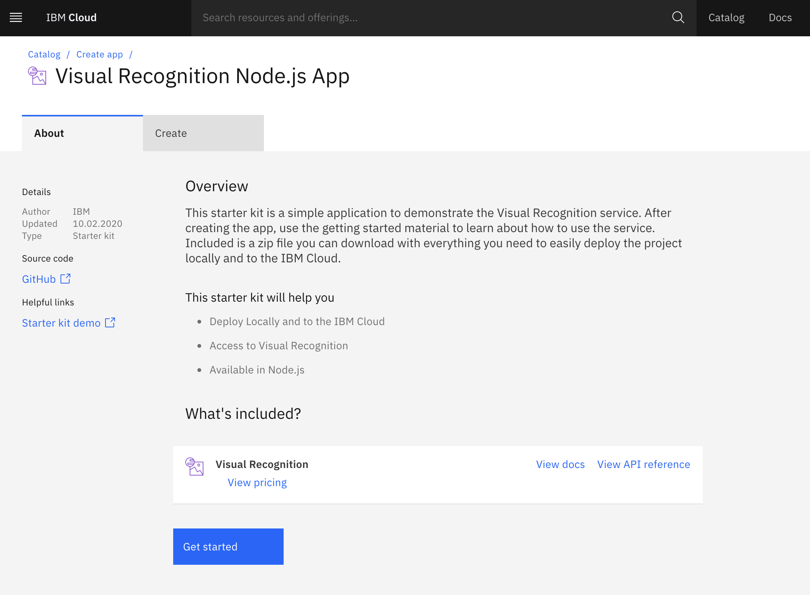      
      
Click 'Get Started'. You are redirected to a page creating your free Visual Recognition instance.      
    
  
 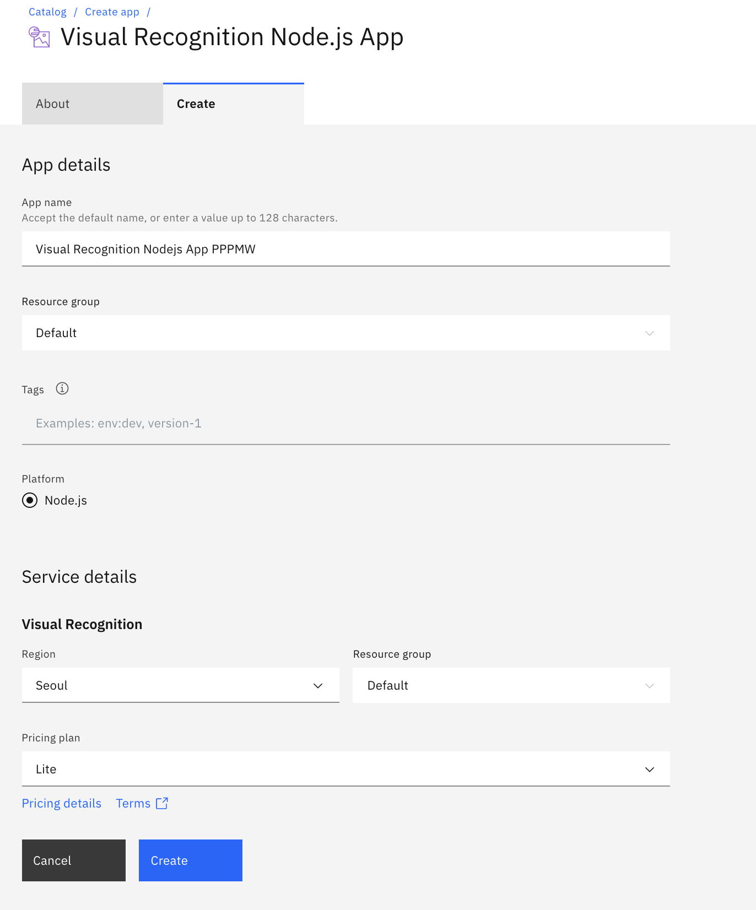      
    
Now you need to choose a region that you previously written down during creation of new space.  
For a pricing plan ensure that you are on Lite. Then click 'Create' button.        
    
 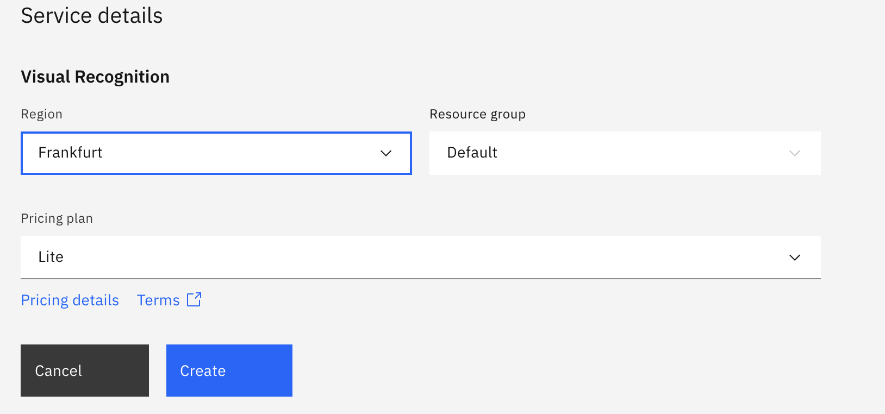      
    
You are redirected to your applications console page, click 'Deploy you App' button.    
      
 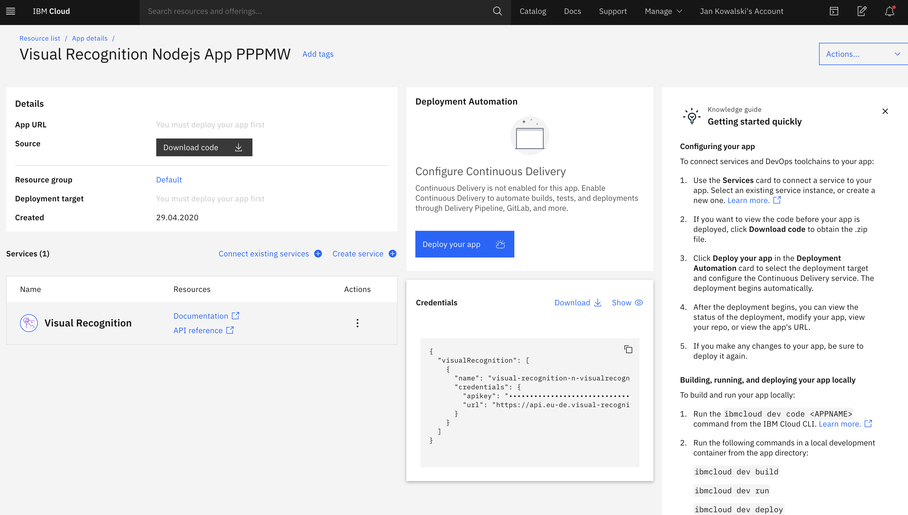    
    

Select Cloud Foundry VM to deploy your app on (as on the screen below).    
    
 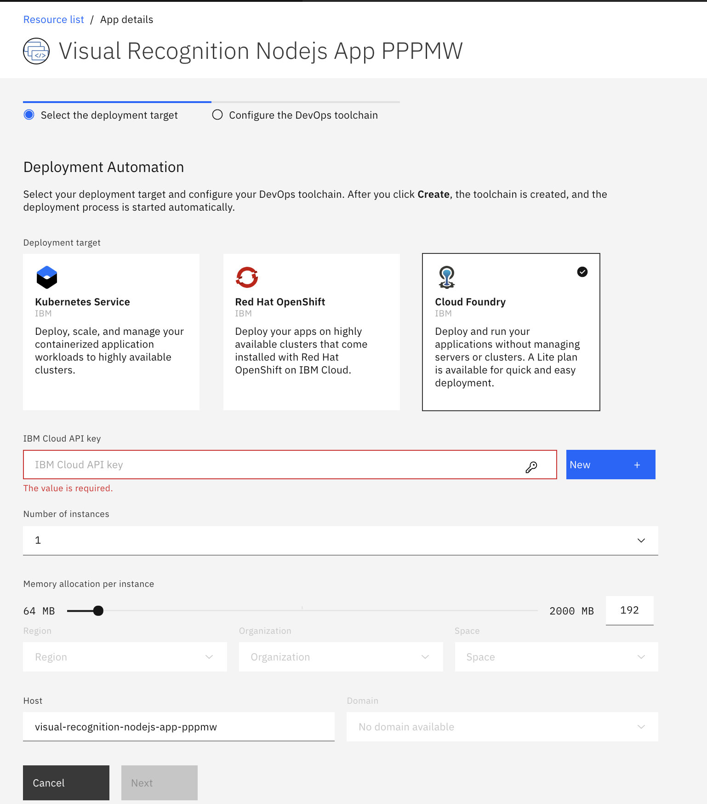    
    
Now you need to click 'New' button in the part 'IBM Cloud API Key'. You will get a following pop up window:    
      
 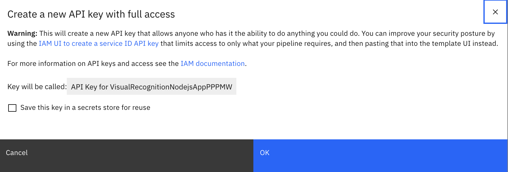      
      
You don't have to save this API key. For simplicity just click OK button and API key will be created for you.    
  

Leave memory allocation as they are.       
Now you need to choose again the region of your organization, and just created space. Now hit the 'Next' button.    
      
 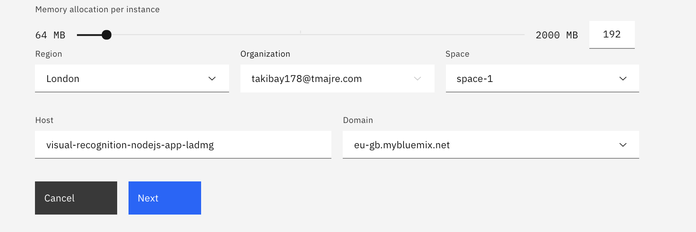      
      
Now you can see the final page before create an app. Ensure the region is region of your organisation and click 'Create'.    
      
 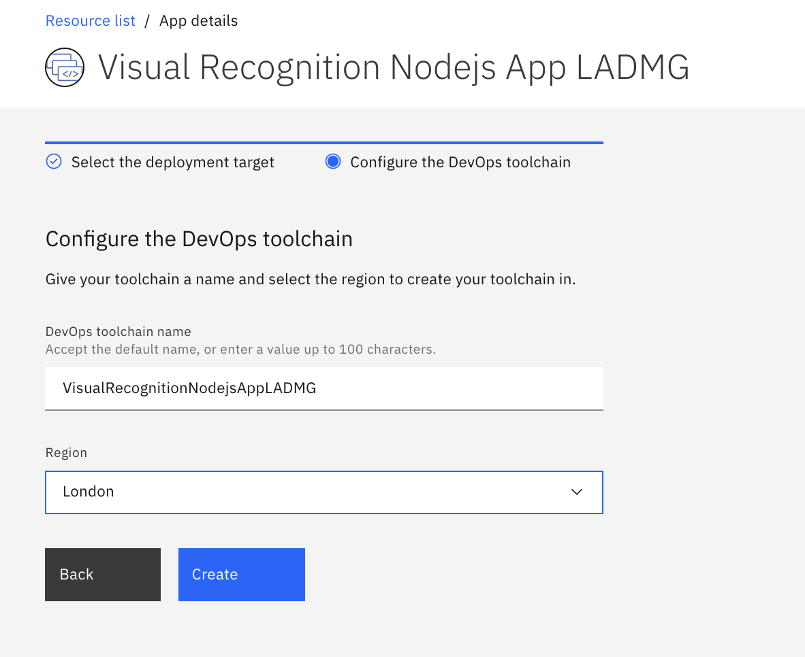      
      
You are going back to applicatoion console page when a lot of things will happen automatically in the background. Wait 5-10 minutes. Finally status 'success' should be visible in the mid-screen as shown below. Click on the application link (black arrow on pic below).  
      
 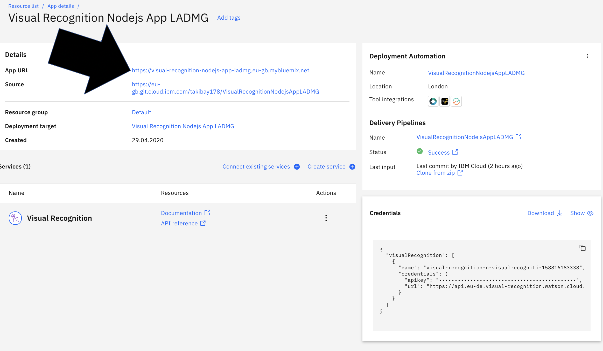      
   
 Now you can enjoy how the trained visual recognition model is analyzing photos. You can upload your custom images and see which classifiers are triggered. Explore the application console and application itself.  
  
      
 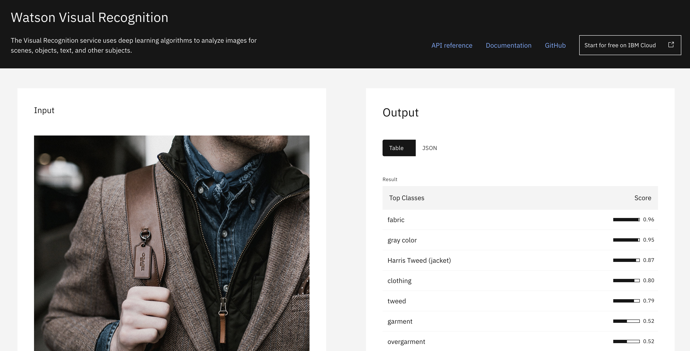      
 
    
  
        
        
# End of Visual Recognition Lab