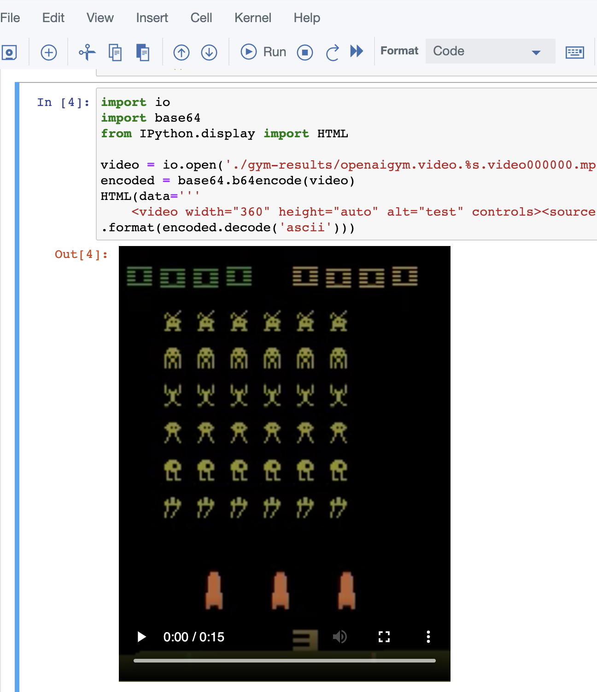
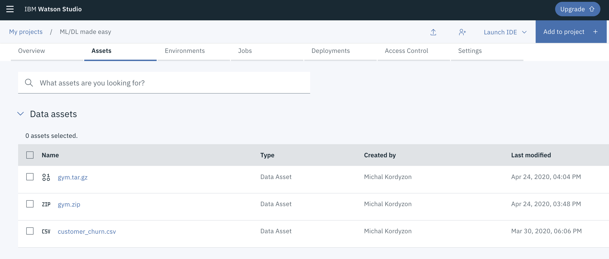
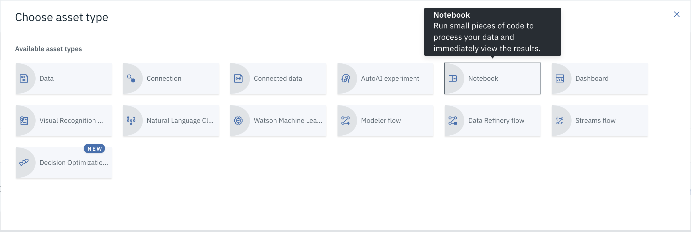
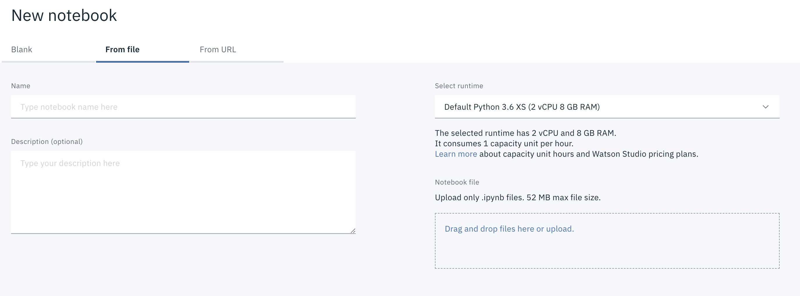

# Lab - running Reinforcement Learning models on Watson Studio          
    
  
Returning to the agenda page?  [CLICK HERE](../README.md)    
      
Or maybe returning to the main page? [CLICK HERE](../../README.md)  

        
    
  
> IMPORTANT: The most important thing for you right now is to take your time and do not rush through the scripts. Rather, try to understand new concepts and let them sink in. You can finish the lab during the workshop but if you don't it's totally OK. You will be able to finish it later.  You can also continue with other labs that you find on the way. This is how any skill is built - by doing.   
    
      
# Task 1. Run Reinforcement Learning model on Watson Studio  
  
Prerequisites for this lab are:

- [ ] Existing **IBM Cloud** account   
  
- [ ] Started instance of **Watson Studio** on your **IBM Cloud** account   
  
- [ ] Notebook with Reinforcement Learning model that you can download here: [RL-notebook](../code/space_invaders.ipynb)  

Reinforcement Learning is fast growing area of machine learning with exiting experiments concenring life and bussiness. This scipt lets you load a notebook with simple RL model where agent is playing old Atari game Space Invaders.  

  
> If you haven't registered to IBM Cloud or haven't started Watson Studio intance, please proceed to Preparation Lab.  
  

Create new project in Watson Studio or open existing one. Click 'Add to Project' button.

 

Select 'notebook' button.

Select 'from file' tab and click on the 'Drag and drop files here or upload' area. 

Now choose the notebook downloaded in the prerequisites section of this script and upload this file to Watson Studio.  

Open the file in Watson Stuio, apply Python environment to it and run it. Enjoy :)

      
# End of Reinforcement Learning Lab
---