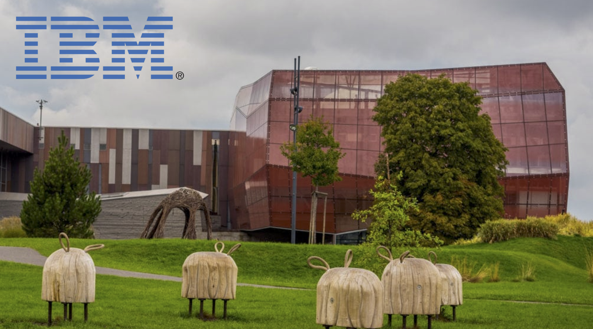

# Watson Studio on IBM Cloud Workshop    
    
  
 
This course is meant for professionals or engineers or any kind with no data science background. The course was used by people from engineering, IT, logistics, marketing, procurement, sales, law, production, and more.    

  
   
      

  
 
## Agenda    
    
**(2 hours in total)**  

+ Introduction to Data Science - 15 min

+ Watson Studio on IBM Cloud Introduction - 15 min 

+ Preparation Lab - 15 min (**lab**)    
  + [1 - Preparation Lab](1-PrepareLab/README.md) 

+ Watson Studio on IBM Cloud - running AutoAI experiment - 30 min (**lab**):    
  + [2 - Watson Studio Lab](2-WatsonStudioLab/README.md)

+ Starting Visual Recognition Application on IBM Cloud - 30 min (**lab**)    
  + [3 - Visual Recognition Lab](3-VisualRecognitionLab/README.md) 

+ Watson OpenScale - 15 min (**demo**)    
+ Q&A    
  + [4 - ExtraStuff - Reinforcement Learning on Watson Lab](4-ExtraStuffOpenAI/README.md)      

  
 
  
 
    
  