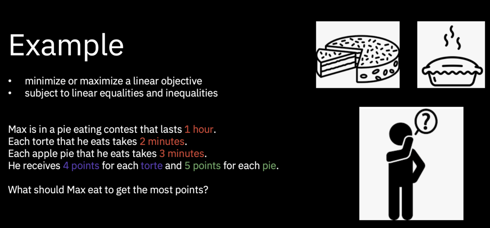

# Lab 1 - Cake Competition Problem  
    
      
    
Returning to the DO Workshop main page?  [CLICK HERE](../README.md)    

Or maybe returning to the home page? [CLICK HERE](../../README.md)    
    

    
      
     
> IMPORTANT: The most important thing for you right now is to take your time and do not rush through the scripts. Rather, try to understand new concepts and let them sink in. You can finish the lab during the workshop but if you don't it's perfectly OK. 

Meet Max :) Max is attending Cake Competition and he wants to win!
He can eat tortes that take 2 minutes to eat or apple pies that take 3 minutes to eat. For one torte Max will get 4 points and for one apple pie - 5 points. 
Now think about what decision variables you would create. Then think about contraints and write down your thoughts. After that just download jupyter notebook and see how it's implemented in the code.

Task 1. Create a project in Watson Studio 

Task 2. Use option 'Add to project', then select option 'from file' and use notebook from link below.

  + [just click here !!!](https://github.com/ertogrul/ertogrul.github.io/blob/master/code/Cake%20Competition%20Problem.ipynb)

Task 3. Run Jupyter Notebook file in Watson Studio and analyze the outcome. Try to change decision variables or minutes needed to eat torte of apple pie. See how it influences result.

        
# End of Cake Competition Problem Lab
