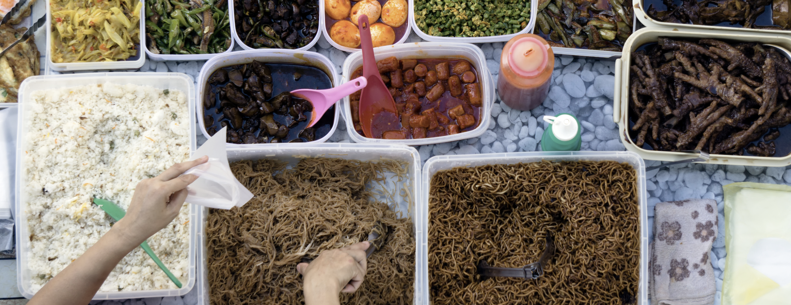

# Lab 2 - Pasta Factory Problem
    
      
    
Returning to the DO workshop maina page?  [CLICK HERE](../README.md)    

Or maybe returning to the home page? [CLICK HERE](../../README.md)    
    

    
      
     
> IMPORTANT: Take your time and do not rush through the scripts. Rather, try to understand new concepts and let them sink in.

So you are running a pasta factory. Your case is a little more complex then counting eaten cakes. Now you've got 3 products (kluski, capellinin, and fettucine) and each of those is producsed witch specific portion of ingredients: flour and eggs. All those products can be produced two ways: internally or externally (with different costs for each option). On top of that, you've got specific orders (demand) for each of your three products. 
Your goal is to minize costs. As you get to the notebook with solution try to tinker with all these variables and see how different scenarios are created for producing kluski, fettucine and capplelini.

Task 1. Create a project in Watson Studio 

Task 2. Use option 'Add to project', then select option 'from file' and use notebook from link below.

  + [Pasta_Factory_Notebook](../../code/balance-pasta-prod.ipynb)

Task 3. Run Jupyter Notebook file in Watson Studio and analyze the outcome. Try to change decision variables or minutes needed to eat torte of apple pie. See how it influences result.

        
# End of Pasta Factory Problem Lab 