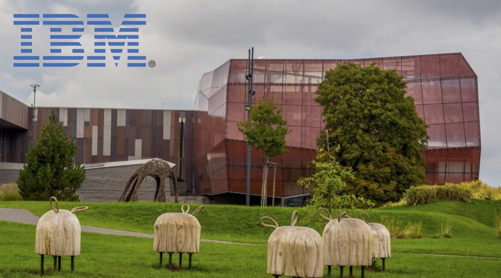

# Watson Studio on IBM Cloud Workshop    
    
  
This course is meant for professionals or engineers or any kind with no data science background. The course was used by people from engineering, logistics, marketing, procurement, sales, law, production, and more.    
     
      
    
## Agenda    
    
**(2 hours in total)**    
+ Introduction to Data Science - 15 min    
+ Watson Studio on IBM Cloud Introduction - 15 min    
+ Preparation Lab - 15 min (**lab**)    
  + [1-PrepareLab/README.md](1-PrepareLab/README.md)    
+ Watson Studio on IBM Cloud - running AutoAI experiment - 30 min (**lab**):    
  + [2-WatsonStudioLab/README.md](2-WatsonStudioLab/README.md)    
+ Starting Visual Recognition Application on IBM Cloud - 30 min (**lab**)    
  + [3-VisualRecognitionLab/README.md](3-VisualRecognitionLab/README.md)    
+ Watson OpenScale - 15 min (**demo**)    
+ Q&A    
  + [4-ExtraStuffOpenAI/README.md](4-ExtraStuffOpenAI/README.md)      
      
    
  